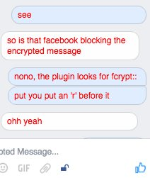
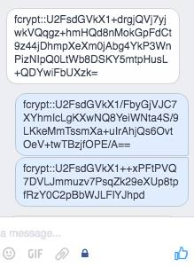

# FCrypt Browser Extension

FCrypt is a browser extension that allows for end to end encrypted chat through the facebook.com chat application. Currently the plugin pnly supports facebook.com and not messenger.com, and only supports chrome. Support for more browsers will be added soon and hopefully support for messenger as well.

<div style="text-center">


</div>

## Getting Started

These instructions will get you a copy of the project up and running on your local machine for development and testing purposes. See deployment for notes on how to deploy the project on a live system.

### Install through the Chrome Web Store

You can install the extension into chrome through the following link: https://chrome.google.com/webstore/detail/fcrypt/iegnoclfhbfgelgobnfekhplapljhcfa

### Install Packaged Extension file

A testing file as a packaged chrome extension file (.crx) can be downloaded from the releases section of this repo and installed into chrome by dragging the .crx file into the chrome extensions settings panel.

### Prerequisities

To get the development version of the extension up and running you will need to clone this repo and install the dependencies by running npm install.

```
git clone https://github.com/Tasemu/FCrypt.git
cd FCrypt
npm install
```

To compile the source you need to run webpack. This will create the files required to run the extension within the /dist/ directory. --watch can be added optionally to watch the files for any changes and recompile automatically.

```
webpack --watch
```

### Installing

Once all Prerequisities are installed, the unpackaged version of the extension can be installed into chrome by opening the extensions settings panel in chrome and selecting the 'developer mode' checkbox. From here you can select to load an unpackaged extension and point it to the /dist/ directory.

## Deployment

You can generate a new packaged .crx file by going to the chrome extensions settings panel and selecting 'package extension', then pointing the packager to the /dist/ directory.

## Built With

* NPM
* FontAwesome
* Remodal V1
* Bililite.js
* jQuery


## Versioning

We use [SemVer](http://semver.org/) for versioning. For the versions available, see the [tags on this repository](https://github.com/Tasemu/FCrypt/tags).

## Authors

* **Montague Monro** - *<montymonro1@gmail.com>* - [Tasemu](https://github.com/Tasemu)

See also the list of [contributors](https://github.com/Tasemu/FCrypt/contributors) who participated in this project.

## License

This project is licensed under the MIT License - see the [LICENSE.md](LICENSE.md) file for details

## Acknowledgments

* [Maximilian Mitchell](https://github.com/maxisme) for his awesome work on Crypter which was the inspiration and base for this extension.
